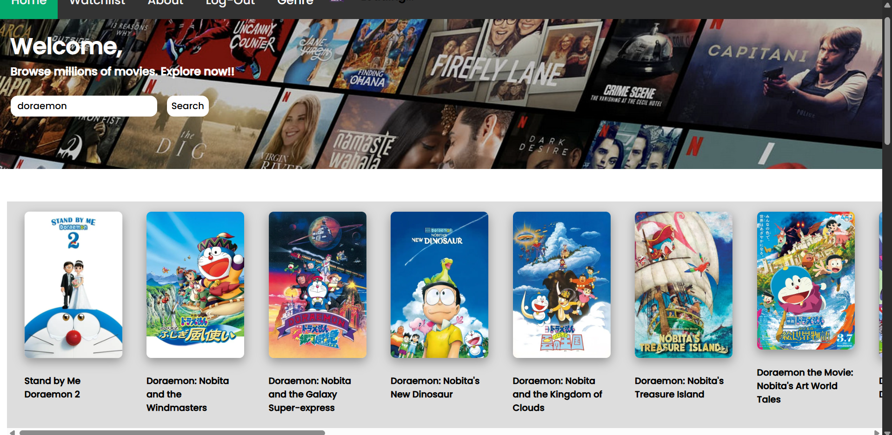

# 🎬 Movie Review Website

A dynamic and interactive movie review web application where users can:

- 🔍 **Search for movies**
- 📝 **View ratings, reviews, release dates**
- 💬 **Access detailed movie descriptions**
- 🔐 **Login/Signup with Google Firebase Authentication**

---

## 🚀 Features

- ✅ **Firebase Auth**: Secure login/signup using Firebase
- 🧠 **Search Functionality**: Find movies by name (e.g., “Doraemon”)
- 📝 **Movie Details Page**: View poster, rating, release date, and summary
- 🎨 **Responsive UI**: Designed for all screen sizes
- 🖼️ **Static Assets**: Images for movies and screenshots

---

## 🛠️ Tech Stack

**Frontend**:
- HTML5, CSS3
- JavaScript (Vanilla)
- Firebase Authentication for user login/signup
- Responsive Design using custom CSS

**Backend**:
- ⚠️ No custom backend — authentication handled via **Firebase**
- Static movie data stored locally (can be extended)

---

## 🔐 Firebase Setup

Used **Google Firebase** for authentication:

- Firebase Auth for login/signup
- Email/password and possibly social login support (Google, etc.)
- No Firestore or Realtime DB used for storage in current version

---

## 🖼️ Screenshots

### 🏠 Landing Page (Post Login)


### 🎬 Movie Description Page


### 🔍 Search Results for "Doraemon"


---

## 📁 File Structure Overview

| File | Purpose |
|------|---------|
| `index.html` | Landing page |
| `login.html`, `login.css` | Firebase login interface |
| `movie-details.html`, `movie-details.js` | Displays selected movie details |
| `mainSite.js` | Main JavaScript logic |
| `image.png`, `image2.png`, `image3.png` | Screenshots |
| `.jpg` files | Movie posters and thumbnails |

---

## 📌 How to Run

1. **Clone the repo**:
   ```bash
   git clone https://github.com/your-username/movie-review-site.git
   cd movie-review-site
