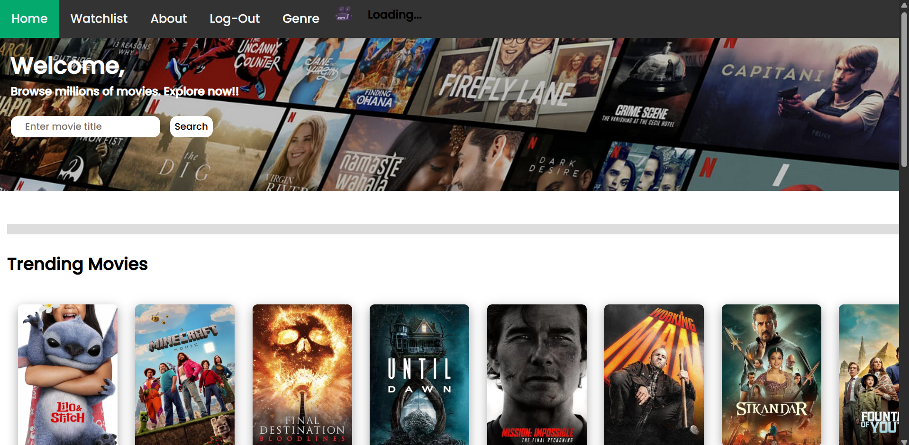

# 🎬 Movie Review Website

A dynamic movie review platform where users can:

- 🔍 Search movies
- 📝 View ratings, release dates, and descriptions
- 🔐 Securely login/signup using Firebase Authentication

This project leverages the **TMDB API** to provide live movie data, ensuring users receive up-to-date and accurate information.

---

## 🚀 Features

- 🔐 **Firebase Authentication**: Secure Google-based login/signup
- 🔍 **Search Movies**: Real-time search functionality powered by TMDB API
- 📝 **Movie Details**: View detailed info like posters, ratings, release dates, and summaries
- 🎨 **Responsive UI**: Smooth design across devices
- 📂 **Movie History Pages**: Seamless browsing through movie details and search results

---

## 🛠️ Tech Stack

**Frontend:**
- HTML5, CSS3
- JavaScript (Vanilla JS)
- Firebase Authentication
- Responsive layout with custom CSS

**External Services:**
- **TMDB API** for real-time movie data
- **Google Firebase** for Authentication

---

## 📸 Screenshots

### 🏠 Landing Page (After Successful Login)


### 🎬 Movie Description Page


### 🔍 Search Results for "Doraemon"


---

## 📁 File Structure Overview

| File | Description |
|------|-------------|
| `index.html` | Landing page after login |
| `login.html`, `login.css` | Firebase authentication page |
| `movie-details.html`, `movie-details.js` | Dynamic movie detail display |
| `mainSite.js` | Search logic and API interactions |
| `.jpg` files | Movie posters |
| `image.png`, `image2.png`, `image3.png` | Project UI screenshots |

---

## ⚙️ How to Run Locally

1. **Clone the repo:**
   ```bash
   git clone https://github.com/your-username/movie-review-site.git
   cd movie-review-site
